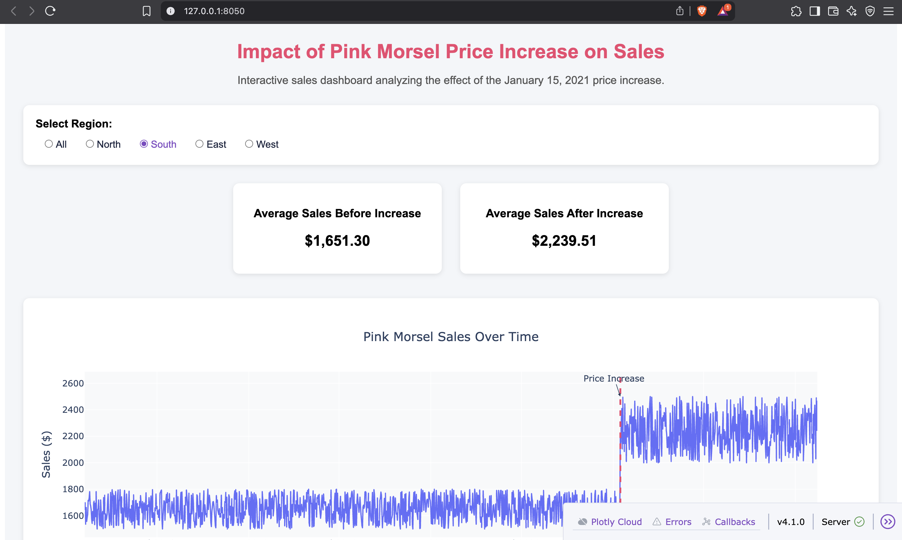

# 📊 Pink Morsel Sales Dashboard (Quantium Virtual Internship)

## 🚀 Overview
This project analyzes the impact of the **January 15, 2021 price increase** on Pink Morsel sales using an interactive data visualization dashboard built with Dash.

The goal is to transform raw transactional data into meaningful insights and answer a real business question:

> Were sales higher before or after the price increase?

---

## 🛠 Tech Stack
- Python
- Pandas
- Dash
- Plotly
- Pytest

---

## 📂 Project Structure
```
├── app.py                      # Dash application
├── formatted_sales_data.csv    # Processed dataset
├── requirements.txt            # Dependencies
├── test_app.py                 # Test suite
└── README.md                   # Project documentation
```

---

## 📈 Features
- 📊 Interactive line chart of sales over time  
- 🌍 Region filter (North, South, East, West, All)  
- 📌 Price increase marker (Jan 15, 2021)  
- 📉 KPI cards showing average sales (Before vs After)  
- 🎨 Clean and styled UI using CSS  
- ✅ Automated test suite for app validation  

---

## ▶️ How to Run the App

```bash
source venv/bin/activate
python app.py
```

Then open:
```
http://127.0.0.1:8050/
```

---

## 🧪 Testing

```bash
pytest
```

### Tests included:
- ✅ Header presence  
- ✅ Graph rendering  
- ✅ Region filter functionality  

---

## 📌 Key Insight
The visualization clearly shows the trend in sales before and after the price increase.
## 📸 Dashboard Preview



---

## 👩‍💻 Author
Shreya Goyal
